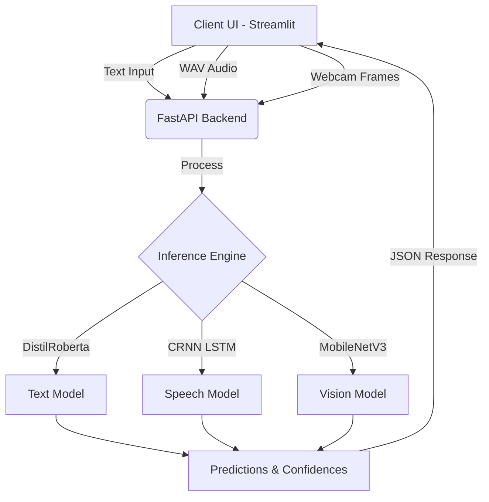

# 🎭 Multi-modal Emotion Recognition System


An end-to-end, real-time emotion recognition system that leverages state-of-the-art Deep Learning models to analyze human sentiment across three distinct modalities: **Facial Expressions**, **Vocal Intonation (Speech)**, and **Text Semantics**.

---

## 🌟 Features

- **Real-Time Vision Processing**: Uses OpenCV Haar Cascades for face extraction and a lightweight MobileNetV3 backbone for instantaneous `<100ms` facial emotion inference.
- **Advanced Audio Analysis**: Processes raw waveforms into Mel-frequency cepstral coefficients (MFCCs) using Librosa, fed through a Convolutional Recurrent Neural Network (CRNN) to capture temporal sentiment variations.
- **Contextual Text NLP**: Utilizes Hugging Face's pre-trained `distilroberta-base` for highly accurate textual emotion mapping.
- **Asynchronous API Engine**: Built on FastAPI to enable seamless, non-blocking high-concurrency inference requests.
- **Rich Interactive Dashboard**: An aesthetically premium, dark-themed Streamlit UI featuring dynamic probability visualizations using Plotly.

---

## 🏗️ Architecture



---

## 📂 Repository Structure

```text
emotion_recognition/
├── api/                    # FastAPI asynchronous application
│   └── main.py             # Inference endpoints (/predict/text, /audio, /vision)
├── app/                    # Frontend presentation layer
│   └── app.py              # Streamlit dashboard
├── data/                   # Data ingestion and prep (FER2013, RAVDESS)
├── inference/              # ML inference orchestration
│   ├── engine.py           # Singleton model loader and predictor
│   └── preprocessors.py    # Modality-specific data transformers
├── models/                 # PyTorch Neural Network definitions
├── training/               # Custom training loops and dataset wrappers
├── utils/                  # Shared configurations and metric tracking
├── Dockerfile              # Containerization configuration
└── requirements.txt        # Production dependencies
```

---

## 🚀 Getting Started

### Prerequisites

- Python 3.9 or higher
- Git
- Microsoft Visual C++ Build Tools (Required on Windows for compiling certain audio dependencies)

### Local Installation

1. **Clone the repository**
   ```bash
   git clone https://github.com/Anu01-tech/Emotion-Recognition-.git
   cd Emotion-Recognition-
   ```

2. **Install dependencies**
   ```bash
   pip install -r requirements.txt
   ```

3. **Initialize Model Weights**
   To prepare the custom architectures (Vision and Speech), you must generate the initial weight definitions via the training scripts:
   ```bash
   python training/train_speech.py
   python training/train_vision.py
   ```
   *(By default, these scripts use placeholder datasets. Point them to your RAVDESS and FER2013 distributions for complete training).*

---

## 💻 Usage

The system operates using a decoupled backend-frontend architecture. **Both servers must be running simultaneously.**

### 1. Launch the Backend API
Start the FastAPI server in your primary terminal:
```bash
uvicorn api.main:app --host 0.0.0.0 --port 8000
```
*The API will be available at `http://localhost:8000` (Visit `/docs` for the interactive Swagger UI).*

### 2. Launch the Frontend Dashboard
Open a new terminal window and run the Streamlit app:
```bash
streamlit run app/app.py
```
*The interactive UI will open in your browser at `http://localhost:8501`.*

---

## 🐳 Docker Deployment

For containerized environments, build and run the provided Docker image. This will spin up both the FastAPI backend and Streamlit frontend concurrently.

```bash
# Build the image
docker build -t emotion-system .

# Run the container mapping both exposed ports
docker run -p 8000:8000 -p 8501:8501 emotion-system
```

---

## 📄 License

This project is licensed under the MIT License.
